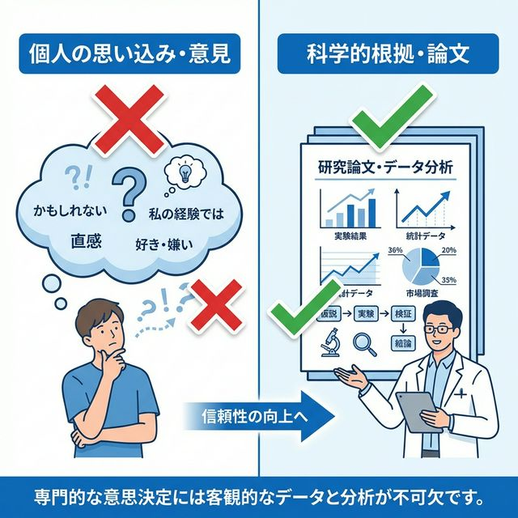
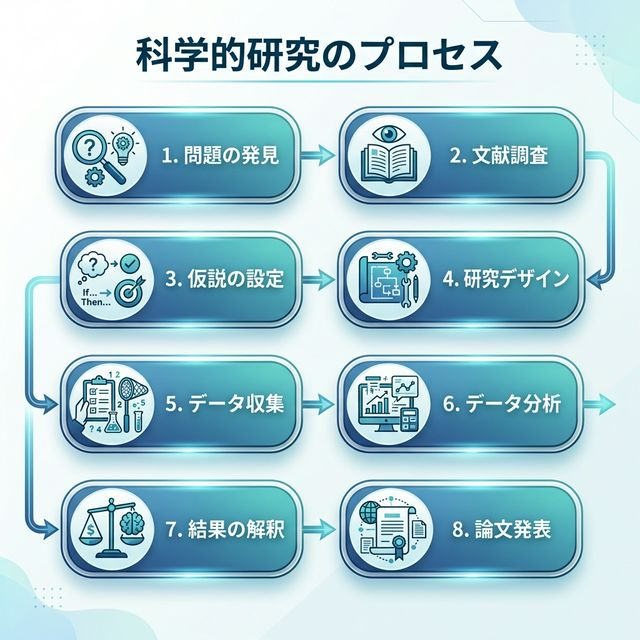
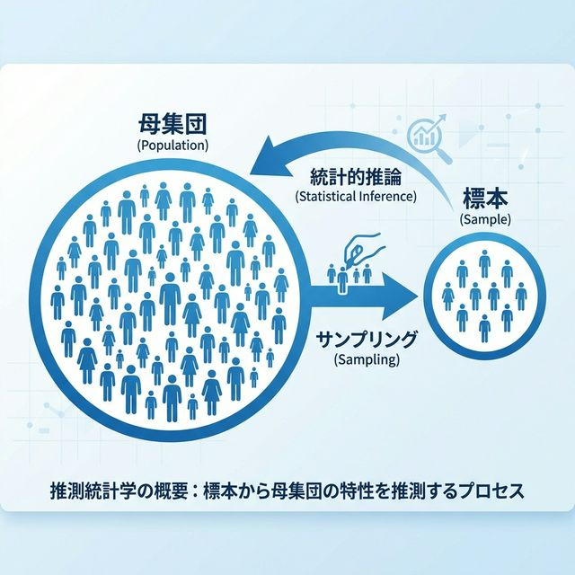
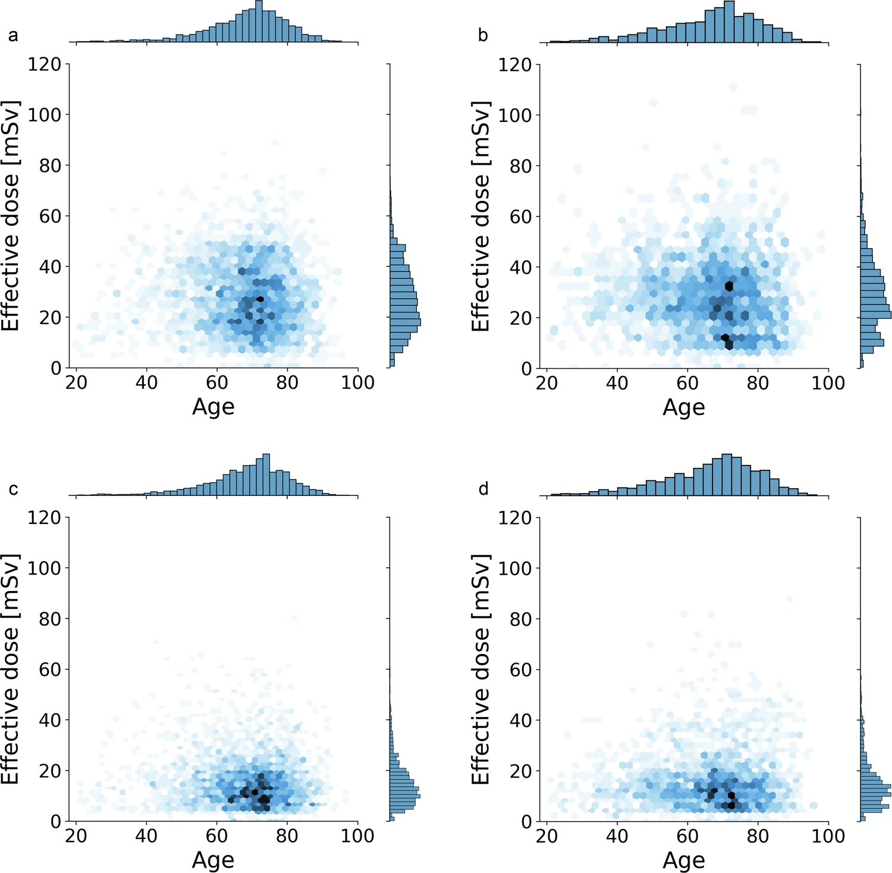
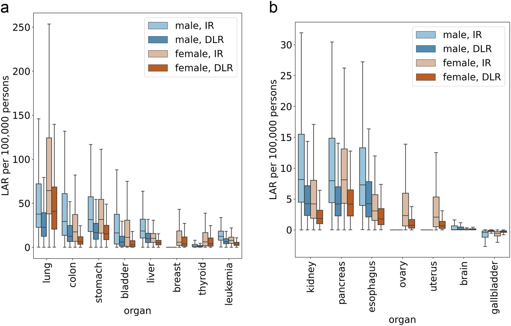
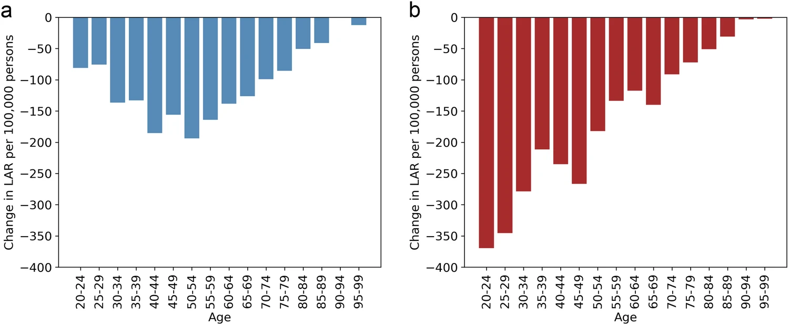

# 生命科学系論文の構造(IMRAD)・統計/機械学習の必要性


---


# 自己紹介


1972年生まれ 54歳
放射線診断学専門医

医師生活29年のうち
- 12年を一般病院
- 4年を大学院 (医学研究科)
- 13年を大学病院勤務

統計・機械学習・プログラミングは独学

<div class="bottom1">
<div class="bottom2">
2010年ころ 天草地域医療センター勤務時
</div>
</div>


---


# 医学研究・応用分野から見たデータサイエンス入門

- 私は医学部在籍時は技術に詳しい医師の育成に携わっていました。

- 今度はデータサイエンスを学ぶ学生の皆さんを対象に、応用分野の一部である医学研究の立場からデータサイエンスをどのように活用しているかを紹介します。


---


## 📋 本日の目標

1. 研究プロセスの全体像を理解する
2. 科学論文の基本構造（IMRAD）を学ぶ
3. データサイエンス研究における統計学・機械学習の役割を理解する
4. ZoteroとPandocの使い方を学ぶ


---


## 0. なぜ論文（客観的証拠）が必要なのか？


- 私たちが新しい発見をしたり、自分の意見を他人に伝えようとするとき、単に「私はこう思う」と言うだけでは、相手を納得させることは困難です。
- 客観的な証拠（エビデンス）がない主張は、第三者からは**単なる個人の思い込み** や **偶然の出来事**と見なされてしまう可能性があります。




---


## 証拠（論文）の役割


1. **客観性の確保**: 誰が見ても納得できるデータや分析結果を示すことで、独りよがりな解釈を防みます。
2. **再現性の保証**: どのような手順でその結果を得たかを公開することで、他人が同じ方法で確認できるようにします。
3. **知識の共有と蓄積**: 正確と検証された知識を論文として残すことで、人類全体の知的な財産として積み上がっていきます。

特に医学やデータサイエンスの分野では、**人の命に関わる意思決定**を扱うため、厳密に検証された「証拠」に基づく判断（EBM: Evidence-Based Medicine）が不可欠です。


---


## 「事実」「解釈」「背景知識」を書き分ける

論文では、自分の意見を自由に書くのではなく、**データ・解析・先行研究に基づいて**主張します。

そのために、次の3つを明確に分ける必要があります。

<div align="center">

| 種類         | 内容                     | 根拠になるもの        |
| :----------- | :----------------------- | :-------------------- |
| **事実**     | 実際に得られた結果       | 自分のデータ          |
| **解釈**     | 結果から考えられる意味   | Results と先行研究    |
| **背景知識** | すでに知られていること   | 引用文献              |

</div>

この3つが混ざると、読者は **「どこまでが証拠に基づく話なのか」** を判断できなくなります。


---


### ❌ 悪い例 と ✅ よい例

**❌ 悪い例**

> LLM はとても有用であり、今後すべての診断に使われるべきである。

主張が強すぎるうえに、**どの結果に基づくのかが不明**です。


**✅ よい例**

> 本研究では、GPT-4 が評価対象モデルの中で最も高い正答率を示した。この結果は、LLM が医学画像関連質問の回答支援に利用できる可能性を示している。

**まず事実（結果）を示し、その範囲内で控えめに解釈**しています。


---


## 生成AI時代における論文・研究の意義 - 何が変わったか？

ChatGPT・Gemini・Claude などの**生成AIの登場**により、プログラミングを取り巻く環境は大きく変化しました。

- コードを1行ずつ手書きしなくても、AIに「やりたいこと」を伝えるだけでコードが生成される時代
- 統計処理・グラフ描画・機械学習モデルの構築まで、AIがドラフトを作れる


では、「統計学・機械学習・プログラミングを学ぶ意味はなくなったのか？」


---


## 何が重要になったか？


**答えはNO。むしろ「考える力」の重要性が高まっています。**

<div align="center">

| 以前                               | 生成AI時代                                 |
| :--------------------------------- | :----------------------------------------- |
| コードを正確に書く技術             | ✅ 引き続き有用だが必須ではなくなりつつある |
| **何を分析するか目標を設定する力** | ⭐ さらに重要                               |
| **結果が正しいか評価する力**       | ⭐ さらに重要                               |
| **モデルの限界を理解する力**       | ⭐ さらに重要                               |

</div>


AIは「指示された通りにコードを書く」ことはできますが、**「何を目的とするか」「結果が正しいか」「研究として意味があるか」を判断することはできません。**


---


### 本講義で重視すること


#### 1. 内容の理解（Why）
- 統計的検定や機械学習モデルが**何をしているか**を理解する
- AIが生成したコードの意味を読み解ける

#### 2. 目標設定（What）
- 研究課題に対して**どの手法が適切か**を選択できる
- 「とりあえずAIに聞く」ではなく、**問いを正確に立てる**


#### 3. 評価項目の設定（How good）
- 分析結果が**科学的に妥当か**を判断できる
- 精度・AUC・p値などの指標の**意味と限界**を理解する
- AIの出力を鵜呑みにせず、**批判的に検証**する


---


> **まとめ**: 生成AI時代に求められるのは「コードを書く人」ではなく、  
> **「何を分析するか設計し、結果を正しく評価できる研究者」** です。  
> 本講義はその力を育てることを目標とします。


---


## 生成AI を論文作成に使うときの注意

ChatGPT や Gemini は、論文作成の**補助**としては有用です。しかし失敗の型が決まっています。

<div align="center">

| ✅ 使ってよいこと                    | ⚠️ AIがやってしまうこと            |
| :---------------------------------- | :-------------------------------- |
| 日本語メモの整理                     | **存在しない論文を作る**           |
| 英語表現の改善                       | **DOI・著者名・雑誌名を間違える**  |
| 段落構成の確認                       | **Results にない数値を追加する**   |
| Results と Discussion の混在チェック | Conclusion を強く言いすぎる        |
| 表現を控えめにする提案               | 臨床応用を過度に断定する           |

</div>

AI は**下書きを整える道具**であり、研究内容の正しさを保証するものではありません。


---


### AI に頼むときは「制限」を明示する

```text
以下の草稿を英語論文らしく整えてください。
ただし、Results にない数値や新しい解析は追加しないでください。
存在しない文献や DOI は作らないでください。
Conclusion は結果から言える範囲にしてください。
```

💡 **禁止事項を先に書く**ことで、上の表の失敗をかなり防げます。


→ 生成された文章は、**必ず自分の Results と照合**してから使うこと。


---


### 1. 研究とは何か？

### 1.1-2 研究の定義とプロセス
研究(Research)とは：
- 新しい知識を発見すること
- 既存の知識を検証・拡張すること
- 問題を解決するための体系的な調査





---


### 1.3 良い研究の条件

- **新規性（Novelty）**: 新しい発見や視点がある
- **妥当性（Validity）**: 方法論が適切で、結果が信頼できる
- **再現性（Reproducibility）**: 他の研究者が同じ結果を得られる
- **意義（Significance）**: 学術的・社会的に価値がある


---


### 2.1 IMRADとは？
科学論文の標準的な構成：
- **I**ntroduction（序論）
- **M**ethods（方法）
- **R**esults（結果）
- **A**nd
- **D**iscussion（考察）


---


### 2.2 各セクションの役割
#### Introduction（序論）
**目的**: 研究の背景と目的を説明
が含まれる内容：
- 研究分野の背景
- 先行研究のレビュー
- 研究の必要性（ギャップ）
- 研究の目的・仮説

**読者への問い**: 「なぜこの研究が必要なのか？」


---


#### Methods（方法）
**目的**: 研究の手法を詳細に記述
が含まれる内容：
- 研究デザイン
- データ収集方法
- サンプルサイズ、対象者
- 分析手法（統計手法、機械学習モデル）
- 使用したソフトウェア・ツール

**読者への問い**: 「どうやって研究したのか？」


---


#### Results（結果）
**目的**: 分析結果を客観的に報告
が含まれる内容：
- 記述統計（平均、標準偏差など）
- 統計的検定の結果（p値、信頼区間）
- 図表（グラフ、表）
- 機械学習モデルの性能（精度、AUCなど）

**読者への問い**: 「何がわかったのか？」


---


#### Discussion（考察）
**目的**: 結果の意味を解釈し、研究の意義を論じる
が含まれる内容：
- 結果の解釈
- 先行研究との比較
- 研究の限界（Limitations）
- 今後の研究方向
- 結論（Conclusion）

**読者への問い**: 「結果は何を意味するのか？」


---


### 2.2 補足 各セクションの「書かないこと」

IMRAD で最も多い失敗は、**セクションの役割が混ざる**ことです。

<div align="center">

| セクション            | 役割                   | 書くこと                                       | ❌ 書かないこと            |
| :-------------------- | :--------------------- | :--------------------------------------------- | :------------------------- |
| Introduction          | なぜ研究するのか       | 背景、先行研究、未解決の問題、目的             | 詳しい結果、深い考察       |
| Materials and Methods | どう調べたのか         | 対象、データ、方法、解析、倫理                 | 結果の解釈                 |
| Results               | 何が分かったのか       | 数値、表、図、観察された結果                   | 理由、意味づけ、感想       |
| Discussion            | それは何を意味するのか | 主要結果、解釈、先行研究との関係、限界、結論   | Results にない新しい解析   |

</div>


---


### よくある「役割の混ざり」4パターン


- Introduction に **Results の数値**を書きすぎる
- Results で **「なぜそうなったか」**を語りすぎる
- Discussion で **新しい結果**を追加する
- Methods に **研究の意義**を書きすぎる


> 一文ごとに「**この文はこのセクションに置くべき文か**」を確認する。


---


### 参考: Discussion の段落構成

<div align="center">

| 段落 | 役割                        | 書く内容                           |
| :--- | :-------------------------- | :--------------------------------- |
| 1    | Principal findings          | 主要結果を簡潔にまとめる           |
| 2    | Interpretation              | なぜその結果になったかを説明する   |
| 3    | Comparison and implications | 先行研究との関係、意義を書く       |
| 4    | Limitations                 | 研究の限界を書く                   |
| 5    | Conclusion                  | 結果から言える範囲でまとめる       |

</div>

各段落の**冒頭にトピック文**を置くと、論理の流れが伝わります。

`The main finding of this study was that ...` / `One possible explanation for this finding is that ...` / `Our findings are consistent with previous studies showing that ...` / `This study has several limitations.` / `In conclusion, ...`


---


### 2.3 【実論文】この論文でIMRADを理解しよう


**Deep learning再構成がCT検査の放射線量とがんリスクに与える影響**

> Kobayashi N, **Nakaura T**, et al.  
> *European Radiology* (2025) 35:3499–3507

https://link.springer.com/article/10.1007/s00330-024-11212-6


この論文のアブストラクトを使って、**IMRADの各セクションを実際に識別**してみましょう。


---


### 📖 アブストラクトを読んでみよう ①

**[Purpose]**

> The purpose of this study is to estimate the extent to which the implementation of **deep learning reconstruction (DLR)** may reduce the risk of radiation-induced cancer from CT examinations, utilizing **real-world clinical data**.


**Q: これはIMRADのどのセクションに対応しますか？**

→ **Introduction**（研究の目的）


---


### 📖 アブストラクトを読んでみよう ②

**[Methods]**

> We retrospectively analyzed scan data of adult patients who underwent body CT during two periods: a **12-month pre-DLR phase** (n = 5553) using hybrid iterative reconstruction and a **12-month post-DLR phase** (n = 5494).  
> **Propensity score matching** 1:1 was employed based on age, sex, and BMI.  
> **Organ-specific equivalent doses**, total effective doses, and **Lifetime Attributable Risk (LAR)** for cancer were estimated.


---


### 📖 アブストラクトを読んでみよう ③

**[Results]**

> After propensity score matching, **5247 cases** from each group were included.  
> Post-DLR, the total effective dose significantly decreased to **15.5 ± 10.3 mSv** from **28.1 ± 14.0 mSv** (p < 0.001), a **45%** reduction.  
> The estimated annual cancer incidence decreased from **0.247%** pre-DLR to **0.130%** post-DLR.


---


### 📖 アブストラクトを読んでみよう ④

**[Conclusion]**

> The implementation of DLR has the possibility to **reduce radiation dose by 45%** and the risk of radiation-induced cancer from **0.247 to 0.130%** as compared with the iterative reconstruction.


💡 **ポイント**: アブストラクト自体がIMRAD構造の縮小版になっている！


---


### 2.4 論文の「位置づけ」を決める — 医用検査の評価は6段階ある

論文を書くときに最初につまずくのが、**「自分の研究は何を示したことになるのか」** が曖昧なままデータを集めてしまうことです。

医用検査（画像診断・検査値・AIモデル）の研究では、この位置づけを整理する古典的な枠組みがあります。

> **Fryback & Thornbury の階層モデル（1991年）**  
> 検査の有効性（efficacy）を **6つのレベル** に分けて考える

数ある評価枠組みのなかで最も広く使われており、AHRQ（米国医療研究・品質庁）の報告書にも標準的な枠組みとして掲載されています。

<https://www.ncbi.nlm.nih.gov/books/NBK56754/table/results.t1/>


---


### Fryback & Thornbury の6段階モデル

<div align="center">

| Level | 名称 | 問い（原文の要旨） |
| :---- | :--- | :----------------- |
| **1** | Technical Efficacy<br>技術的有効性 | 検査室（実験）レベルで、その検査は**測ろうとしているものを本当に測れているか**？ |
| **2** | Diagnostic Accuracy Efficacy<br>診断精度 | 感度・特異度などの**検査特性**はどうか？<br>疾患を疑うことが臨床的に妥当な患者のなかで、疾患のある人とない人を**区別できる**か？ |
| **3** | Diagnostic Thinking Efficacy<br>診断思考 | その検査は臨床医が**診断に到達するのを助ける**か？<br>医師の**検査前確率**の見積もりを変えるか？ |
| **4** | Therapeutic Efficacy<br>治療的有効性 | **治療計画の立案**に役立つか？<br>予定されていた治療を**変更・中止**させるか？ |
| **5** | Patient Outcome Efficacy<br>患者アウトカム | **患者はその検査から利益を得る**か？<br>検査を受けた患者は、受けなかった同様の患者より**良い転帰**をたどるか？ |
| **6** | Societal Efficacy<br>社会的有効性 | **費用便益・費用対効果**はどうか？ |

</div>


---


### なぜ論文作成でこれが重要か

このモデルは「検査の分類表」ではなく、**論文の書き方を決める道具**です。

- **Introduction**: 「本研究は Level 2 を対象とする」と決まれば、**目的の文が一文で書ける**
- **Methods**: Level が決まれば、必要な**対象集団とデザイン**が決まる（Level 2 なら参照基準が必須、Level 5 なら比較群と追跡が必須）
- **Results**: Level ごとに**示すべき指標が違う**（Level 2 → 感度・特異度・ROC/AUC、Level 5 → 生存率・イベント発生率）
- **Discussion / Limitations**: 「本研究は Level 2 までの評価であり、患者アウトカム（Level 5）への影響は今後の検討課題である」と**限界を正確に書ける**


---


### ⚠️ 最も多い査読指摘 —「レベル飛び越え」

自分の結果より**上のレベル**の主張をしてしまうのが、初学者に最も多い失敗です。

<div align="center">

| 得られた結果（Level） | ❌ 言ってはいけない主張 | ✅ 書ける主張 |
| :-------------------- | :---------------------- | :------------ |
| ノイズが減った（Level 1） | 「診断能が向上した」 | 「画質指標が改善した」 |
| AUC 0.95 だった（Level 2） | 「予後が改善する」 | 「疾患の識別能が高い可能性がある」 |
| 医師の確信度が上がった（Level 3） | 「医療費が削減できる」 | 「診断過程に寄与しうる」 |

</div>

> **原則**: 主張できるのは、**自分のデータが到達したレベルまで**。  
> それより上は「今後の課題（future work）」として書く。


---


### 例: DLR論文をこのモデルに当てはめる

先に読んだ Deep learning 再構成（DLR）の論文を分解してみましょう。

| 研究内容 | 対応する Level |
| :------- | :------------- |
| 再構成画像のノイズ・空間分解能の測定 | Level 1（技術的有効性） |
| 病変検出能を読影実験で比較 | Level 2（診断精度） |
| 線量45%低減 → 生涯がんリスク（LAR）推定 | Level 5–6 に接近（推定モデル経由） |

💡 この論文は「画質の話」に留めず、**リスク推定を介して患者・社会レベルの含意まで接続**した点が新規性になっています。

同じことは機械学習研究にも当てはまります。**「AUCが高い」は Level 2 止まり**であり、臨床的有用性を示すには別のデザインが必要です。


---


### 📚 引用のしかた（Zotero の練習にも）

この表は AHRQ 報告書に**再掲されたもの**です。引用は**原典を優先**します。

- **原典（一次文献）**  
  Fryback DG, Thornbury JR. The efficacy of diagnostic imaging. *Med Decis Making*. 1991;11(2):88–94. (PMID: 1907710)

- **表の掲載元（二次文献）**  
  Sun F, Bruening W, Erinoff E, et al. *Addressing Challenges in Genetic Test Evaluation: Evaluation Frameworks and Assessment of Analytic Validity*. Rockville (MD): Agency for Healthcare Research and Quality (US); 2011 Jun. Results, Table 1.  
  <https://www.ncbi.nlm.nih.gov/books/NBK56754/table/results.t1/>

> **ルール**: 二次文献で見つけた内容は、**原典を確認してから原典を引用**する。  
> 原典が入手できない場合のみ「（〜に引用されている）」と明記する。


---


### 📎 Citation は「他人の知識」に付ける

<div align="center">

| ✅ Citation が **必要** な文             | ❌ Citation が **不要** な文        |
| :-------------------------------------- | :--------------------------------- |
| 先行研究の結果を述べる文                 | 本研究で得られた結果を述べる文      |
| レビューやガイドラインの内容を述べる文   | 本研究の目的を述べる文              |
| 一般的な医学的・科学的知識を述べる文     | 本研究の限界を述べる文              |
| 自分の結果を先行研究と比較する文         | Results から直接導かれる結論        |

</div>

判断の基準は **「それは他人の知識か、自分のデータか」** です。


---


### Markdown / Pandoc での引用の書き方

```markdown
Previous studies have evaluated LLMs in radiology-related tasks [@citation_key].
```

複数の文献をまとめる場合はセミコロンで区切ります。

```markdown
Several studies have reported the potential of LLMs in medical applications [@citation_key_1; @citation_key_2].
```

著者名を文中に出す場合も、citation key は文末に置きます。

```markdown
Bhayana et al. reported that ChatGPT achieved moderate accuracy on radiology board-style questions [@citation_key].
```

⚠️ `citation_key` は必ず `references.bib` に**存在するもの**を使う（詳細は巻末の補足）。


---


## 5. 論文を書く順番はIMRADとは違う

### 「読む順番」と「書く順番」

論文は **IMRAD の順番で書かれている** ものですが、  
実際に書くときの順番は**異なります**。

<div align="center">

| 掲載順番（IMRAD） | 書く順番（実際）           |
| :---------------- | :------------------------- |
| Introduction      | **① Results（結果）**      |
| Methods           | **② Methods（方法）**      |
| Results           | **③ Introduction（序論）** |
| Discussion        | **④ Discussion（考察）**   |
| —                 | **⑤ Abstract**             |
| —                 | **⑥ Title（最後！）**      |

</div>


---


### なぜ Results から書くのか？


> **論文の核心は「データで何を示したか（Results）」**


- **Results が決まって初めて**、それを検証した Methods に説得力が生まれる
- **Results を踏まえて初めて**、なぜこの研究が必要かの Introduction が書ける
- Abstract は全セクションの要約なので、**最後に書く**


→ まずデータを分析・可視化して、**Results（結果）を固めることが論文執筆の第一歩**


---


### Results を書くために何が必要か？


データから「何がわかったか」を示すには：

- **記述統計**：平均・分散・分布でデータの特徴を把握
- **仮説検定**：「差がある」「関連がある」を統計的に確認
- **機械学習**：大量データからパターンを自動抽出
- **可視化**：表・グラフ・図で「見える化」


→ これが **データサイエンスが論文に必要な理由**


---


### 3. なぜ統計学・機械学習が必要か？

### 3.1 データサイエンス研究の特徴

現代の研究では、大量のデータを扱うことが一般的：
- 医学：電子カルテ、医学画像、ゲノムデータ
- 社会科学：アンケート、SNSデータ
- 工学：センサーデータ、シミュレーション結果
→ **統計学・機械学習が不可欠**


---


### 3.2 統計学の役割
#### 記述統計
- データの特徴を要約（平均、分散、分布）
- 可視化（ヒストグラム、散布図）

#### 推論統計
- サンプルから母集団の性質を推定
- 仮説検定（差があるか？関連があるか？）
- 信頼区間の計算


---


**母集団と標本**:  
研究の対象となるグループ全体を **母集団(Population)** と呼びますが、現実的にその全員を調査することは不可能です。そのため、一部のデータ（**標本：Sample**）を抽出し、そこから全体の特徴を推測します。




---


**推論の流れ**:
1. **サンプリング**: 母集団から一部のデータを集める
2. **統計的推論**: 集めたデータの結果に基づき、母集団全体でも同じことが言えるかを確率的に判断する


---


**例**: 新薬の効果を検証
- 仮説：「新薬は既存薬より効果がある」
- 方法：臨床試験でデータ収集
- 分析：t検定でp値を計算
- 結論：p < 0.05なら「統計的に有意な差がある」


---


### 3.3 機械学習の役割
#### 予測モデルの構築
- 過去のデータから未来を予測
- 例：患者の予後予測、疾患の診断
#### パターンの発見
- データから隠れたパターンを抽出
- 例：遺伝子発現データのクラスタリング
#### 自動化
- 人間が行っていた作業を自動化


---


### 3.4 統計学 vs 機械学習


<div align="center">

| 項目     | 統計学                   | 機械学習                 |
| :------- | :----------------------- | :----------------------- |
| 目的     | 仮説検定、因果推論       | 予測、パターン認識       |
| 解釈性   | 高い（係数の意味が明確） | 低い（ブラックボックス） |
| データ量 | 少量でもOK               | 大量のデータが必要       |
| 例       | t検定、回帰分析          | ニューラルネットワーク等 |

どちらか一方ではなく、**両方を使い分ける**ことが重要

</div>


---


### 📊 論文の図を読んでみよう ① 総放射線量の変化



- **a, b**: DLR導入前（IR法）の男女別分布
- **c, d**: DLR導入後（DLR法）の男女別分布
- 縦軸：実効線量 [mSv] 横軸：年齢
- 点群が大幅に**下方移動** → 線量が全体的に減少


---


### 📊 論文の図を読んでみよう ② 臓器別がんリスク（LAR）



- 各臓器の **LAR**（生涯がん発症リスク / 100,000人）を比較
- 薄色：IR法　濃色：DLR法
- 肺・大腸でリスク低下が顕著
- **女性の方がリスクが高い傾向**


---


### 📊 論文の図を読んでみよう ③ 年齢別LARの変化量

<div align="center">


</div>

- **a（青）**: 男性　**b（赤）**: 女性
- 縦軸：DLR導入によるLAR変化量 （マイナス = リスク減少）
- **若年者, 女性ほど効果が大きい**


---


### 📐 今度は「作る側」のルール — 表・図・数値

表と図は飾りではなく、**本文の主張を支える証拠**です。

- 本文中で **Table 1、Figure 1 のように参照**する
- 表・図に**タイトルと legend** を付ける
- 表・図の数値と**本文の数値を一致**させる
- **単位を統一**する
- **小数点以下の桁数をそろえる**（過度に細かい桁は避ける）


---


### 本文での参照のしかた

```markdown
The number of questions in each subspecialty is shown in Table 1.

Overall model accuracy is summarized in Table 2.

The distribution of model performance is shown in Figure 1.
```


⚠️ 表や図を入れたら、**本文でも必ずその意味を説明**します。  
貼っただけで本文に説明がない図表は、査読で必ず指摘されます。


---


## 4. 医学データサイエンス研究の例

「新型コロナウイルスの空気伝播に対するマスクの防御効果」  
(Effectiveness of Face Masks in Preventing Airborne Transmission of SARS-CoV-2)  
-> マスクは感染予防効果に重要


新型コロナウイルス感染対策による聴き取り阻害を定量化する試み  
-> 遮蔽板とマスクを併用した場合は聞き取り阻害の原因になりうる


---


それぞれの論文は**矛盾している**わけではありません。それぞれの論文が**「誰を対象に」「何を目的として」「どのような条件で」**研究を行ったかが異なるからです。


<div align="center">


|          | 論文① (感染リスク) | 論文② (聴き取り環境) |
| :------- | :----------------- | :------------------- |
| **対象** | 一般集団           | 聴力疎通環境         |
| **目的** | 感染拡大防止       | 聴き取りへの影響     |
| **結論** | 感染予防に有効     | 併用は阻害しうる     |

</div>


---


論文を読み際には、以下の点を必ず確認しましょう：

1. **対象（Population）**: どんな集団・環境を研究しているか？
2. **目的（Objective/Intervention）**: 何を調べているか？
3. **結論（Conclusion）**: その条件のもとで何が言えるか？（限界は？）


---


# 補足: Markdown / Zotero / Pandoc の基本

ここからは、論文原稿を **Markdown で書き**、**Zotero の文献情報**を使って **Word ファイルに変換**するための最小限の手順です。

この授業では、次のファイル名で進めます。

<div align="center">

| ファイル           | 役割                     |
| :----------------- | :----------------------- |
| `paper.md`         | 原稿本体                 |
| `references.bib`   | 文献情報（Zotero から出力） |
| `vancouver.csl`    | 引用の表示スタイル       |
| `Reference.docx`   | Word のスタイル見本      |

</div>

💡 **これらは同じフォルダに置く**のが基本です。


---


## 1. Markdown 書式 — 見出しと箇条書き

**見出し**（`#` の数が少ないほど大きい）

```markdown
# Title
## Introduction
### Background
```

**箇条書き / 番号付きリスト**

```markdown
- item 1
- item 2
```

```markdown
1. First
2. Second
```

**強調**

```markdown
**重要な語句**
```


---


## 1. Markdown 書式 — 表と画像

**表**

```markdown
| Model | Accuracy |
|---|---|
| GPT-4 | 65.7% |
| Gemini-Pro | 62.3% |
```

**画像**

```markdown

```

⚠️ 画像ファイルの**実際の場所**と Markdown に書いた**パス**が一致していないと、Word 変換時に画像が表示されません。


---


## 2. Zotero から BibTeX を出力する

Zotero は文献管理ソフトです。Pandoc で文献リストを作るには、BibTeX 形式で書き出します。

1. Zotero に使用する論文を登録する
2. 使用する文献を選択する
3. 右クリックして `Export Items...` を選ぶ
4. 形式として **`BibTeX`** を選ぶ
5. **`references.bib`** という名前で保存する
6. `paper.md` と**同じフォルダ**に置く

→ ここで得られる `citation_key` を、本文の `[@citation_key]` に使います。


---


## 3. Pandoc で Word に変換する

**引用なしの単純な変換**

```bash
pandoc paper.md -o paper.docx
```

**引用文献を反映する変換**

```bash
pandoc paper.md --citeproc --bibliography=references.bib -o paper.docx
```

**授業用の Word スタイルを反映する場合**

```bash
pandoc paper.md --citeproc --bibliography=references.bib --reference-doc=Reference.docx -o paper.docx
```

💡 Pandoc 変換は**最後の仕上げではなく、途中で何度も実行**して表示を確認すると修正が楽になります。


---


## 4. CSL ファイルで引用スタイルを指定する

CSL ファイルは、**引用と文献リストの表示形式**を指定するファイルです。医学系では Vancouver 形式がよく使われます。

**コマンドで指定する**

```bash
pandoc paper.md --citeproc --bibliography=references.bib --csl=vancouver.csl --reference-doc=Reference.docx -o paper.docx
```

**YAML header で指定する**

```markdown
---
title: "Paper title"
bibliography: references.bib
csl: vancouver.csl
---
```


---


## 5. 変換後に必ず確認すること

- `paper.md`、`references.bib`、CSL ファイルが**同じフォルダ**にある
- `--bibliography=references.bib` の**ファイル名が正しい**
- 本文の `[@citation_key]` が **`references.bib` に存在する**
- **画像ファイルのパス**が正しい
- 変換後の `paper.docx` を開き、**引用・参考文献リスト・表・図**が正しく表示されている


⚠️ CSL を指定しても、`[@citation_key]` が `references.bib` に無ければ引用は正しく出ません。
